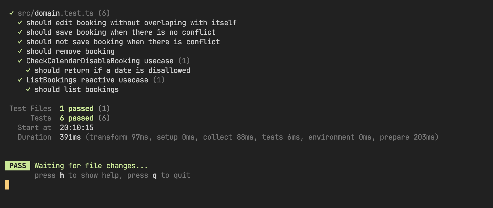

# Booking react ploc ts

## Technologies

- React
- Typescript
- Ploc

## Running project

## Running project tests

## Architecture

This project uses principles from Clean architecture, which could be a way to organize the code in a way that it is easy to understand and maintain.

The main idea is to separate the code in layers, where each layer has a specific responsibility.

The layers are:

- **Presentation**: This layer is responsible for the UI. It contains the components and the pages. It's the only layer that knows about React.

- **Domain**: This layer contains the business rules. It's a pure javascript/typescript layer, which means that it doesn't have any dependencies on any other layer. It's the core of the application.

  - **Entities**: This is where the domain models are defined. They are simple classes that represent the data of the application.

  - **Use cases**: This is where the business rules are defined. They are simple classes that contain methods that perform some action in the application.

  - **Service**: This layer is responsible for the communication with external services. It contains the interfaces that define the methods that the services should implement. But, in the moment, it just contains memory implementation.